## :memo: About

自身の創作活動の合間にRPGツクールMV/MZ用プラグイン/ツールの作成・公開を行っています。

シンプルで使いやすい、他と組み合わせて使いやすい、制作者が色々工夫して使える、を第一に制作しています。

## :gift: Main Projects

> [!IMPORTANT]
> GitHubではの制作物のコード管理・公開を行っています。  
> 開発者向けの内容となります。  
> ユーザー向け制作物の配布および利用方法の解説は<a href="https://www.utakata-no-yume.net" target="_blank">Webサイト</a>にて実施しております。

> [!NOTE]
> RPGツクールMv/MZ用プラグインのバグ報告などについては<a href="https://www.utakata-no-yume.net/contact/rpgmvmz/" target="_blank">Webサイトのお問い合わせフォーム</a>からお願いいたします。

### :electric_plug: RPGツクールMZ(RPGMakerMZ)用プラグイン

コアスクリプトの更新などに追従しつつ、順次更新予定です。

<a href="https://github.com/t-akatsuki/UTA_MessageSkipMZ" target="_blank">
  <picture>
    <source srcset="./assets/profile/pin-card-UTA_MessageSkipMZ-dark.svg" media="(prefers-color-scheme: dark)">
    
  </picture>
</a>

<a href="https://github.com/t-akatsuki/UTA_CommonSaveMZ" target="_blank">
  <picture>
    <source srcset="./assets/profile/pin-card-UTA_CommonSaveMZ-dark.svg" media="(prefers-color-scheme: dark)">
    
  </picture>
</a>

### :electric_plug: RPGツクールMV(RPGMakerMV)用プラグイン

最初期の頃に作ったものが多いため、順次リファイン予定です。

<a href="https://github.com/t-akatsuki/UTA_MessageSkipMV" target="_blank">
  <picture>
    <source srcset="./assets/profile/pin-card-UTA_MessageSkipMV-dark.svg" media="(prefers-color-scheme: dark)">
    
  </picture>
</a>

<a href="https://github.com/t-akatsuki/UTA_CommonSaveMV" target="_blank">
  <picture>
    <source srcset="./assets/profile/pin-card-UTA_CommonSaveMV-dark.svg" media="(prefers-color-scheme: dark)">
    
  </picture>
</a>

<a href="https://github.com/t-akatsuki/UTA_EncounterControlMV" target="_blank">
  <picture>
    <source srcset="./assets/profile/pin-card-UTA_EncounterControlMV-dark.svg" media="(prefers-color-scheme: dark)">
    
  </picture>
</a>

## :star: Github Status

<picture>
  <source srcset="./assets/profile/top-languages-card-dark.svg" media="(prefers-color-scheme: dark)">
  
</picture>

- 最近はその他に Python や PHP を利用する機会が多いです。

## :zap: Skill Stack

アプリケーション開発からWeb開発まで半フルスタックで頑張っています。  
興味あるものは積極的に雑多に色々触っています!

### :computer: Desktop Application Development Skills

<picture>
  <source srcset="https://skillicons.dev/icons?i=cpp,cs,visualstudio" media="(*)">
  
</picture>

### :spaghetti: Web Frontend Development Skills

<picture>
  <source srcset="https://skillicons.dev/icons?i=html,css,sass,js,ts,electron,vscode" media="(*)">
  
</picture>

### :ramen: Web Backend Development Skills

<picture>
  <source srcset="https://skillicons.dev/icons?i=py,django,flask,php,mysql,postgres,vscode" media="(*)">
  
</picture>

### :cloud: Infrastuructures/IaC Skills

<picture>
  <source srcset="https://skillicons.dev/icons?i=aws,docker,ansible" media="(*)">
  
</picture>

## :link: Links

- <a href="https://www.utakata-no-yume.net" target="_blank">うたかたの夢跡</a>
- <a href="https://pages.github.utakata-no-yume.net/" target="_blank">うたかたの夢跡GitHubポータル</a>
- <a href="https://x.com/t_akatsuki" target="_blank">X(Twitter)</a>
- <a href="https://bsky.app/profile/t-akatsuki.utakata-no-yume.net" target="_blank">Bluesky</a>
